<!-- ===================== BANNER ===================== -->
<p align="center">
  
</p>
</p>

<p align="center">
  <a href="https://pruthviraj-rathod.netlify.app/"></a>
  <a href="https://www.linkedin.com/in/pruthviraj-rathod-cs/"></a>
  <a href="mailto:rathod46@uwindsor.ca"></a>
</p>


<!-- ===================== ABOUT ===================== -->
##  &nbsp;About Me

```js
const pruthviraj = {
  education : "Master of Applied Computing @ University of Windsor",
  base      : "Computer Science Engineering + 1 yr as a Software Developer",
  domains   : ["Software Development", "Data & Analytics",
               "Cloud & DevOps", "AI / ML", "IT Systems & Support"],
  builds    : ["Web Apps", "APIs & Backends", "Data Pipelines",
               "Dashboards", "ML Models", "Automation"],
  approach  : "Pick up the tool the problem needs, then go deep",
  currently : "Building projects across multiple tech domains",
  portfolio : "pruthviraj-rathod.netlify.app",
  reach     : "rathod46@uwindsor.ca"
};
```

- 🎓 &nbsp;Master of Applied Computing — **University of Windsor**, with a **Computer Science Engineering** background
- 💼 &nbsp;**1+ year** as a Software Developer, shipping real systems for business users
- 🧩 &nbsp;I work across **software development, data analytics, cloud, AI/ML and IT systems** — not locked into one lane
- 🛠 &nbsp;Comfortable **end to end**: frontend, APIs, databases, pipelines, deployment
- ⚡ &nbsp;Quick to pick up **new tools, frameworks and workflows** independently
- 🤝 &nbsp;Strong team player — equally at home in structured and fast-moving environments
- 🌐 &nbsp;Portfolio → https://pruthviraj-rathod.netlify.app/
- 📫 &nbsp;Reach me → rathod46@uwindsor.ca


<!-- ===================== TECH ===================== -->
##  &nbsp;Languages & Tools

<table align="center">
<tr><td align="center" width="150"><b>Languages</b></td><td>

</td></tr>

<tr><td align="center"><b>Frontend</b></td><td>

</td></tr>

<tr><td align="center"><b>Backend</b></td><td>

</td></tr>

<tr><td align="center"><b>AI / ML</b></td><td>

&nbsp;


</td></tr>

<tr><td align="center"><b>Data</b></td><td>

&nbsp;


</td></tr>

<tr><td align="center"><b>Cloud & DevOps</b></td><td>

</td></tr>

<tr><td align="center"><b>Tools</b></td><td>

</td></tr>
</table>


<!-- ===================== STATS ===================== -->
##  &nbsp;GitHub Stats

<p align="center">
  
  
</p>

<p align="center">
  
</p>

##  &nbsp;Contribution Graph

<p align="center">
  
</p>


<!-- ===================== CONNECT ===================== -->
## 🌐 Connect With Me

<p align="center">
  <a href="https://pruthviraj-rathod.netlify.app/"></a>
  <a href="https://www.linkedin.com/in/pruthviraj-rathod-cs/"></a>
  <a href="mailto:rathod46@uwindsor.ca"></a>
  <a href="https://github.com/pruthvi4344"></a>
</p>

<p align="center">
  
</p>


